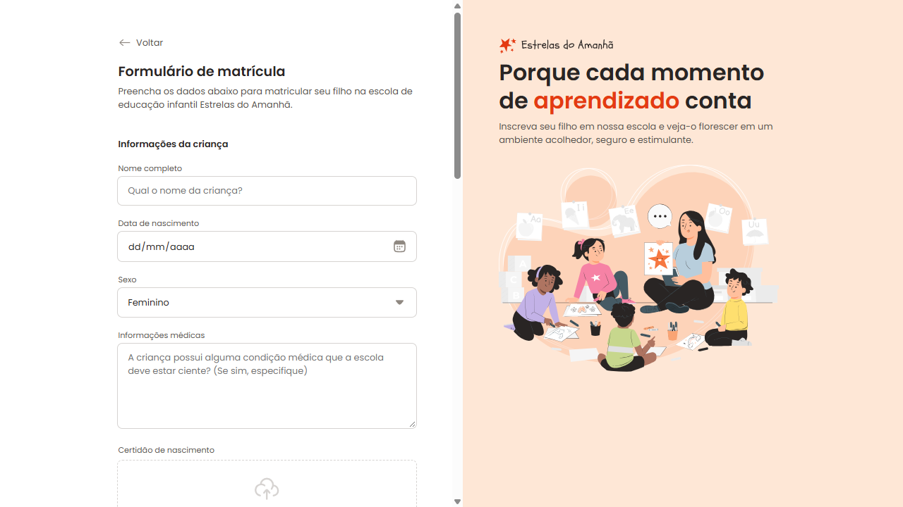
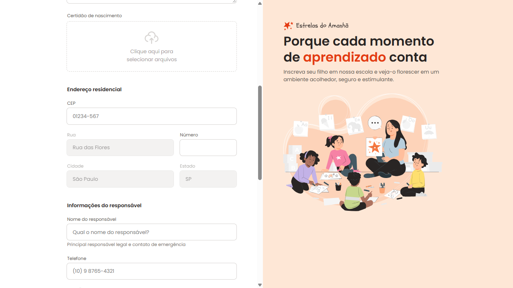
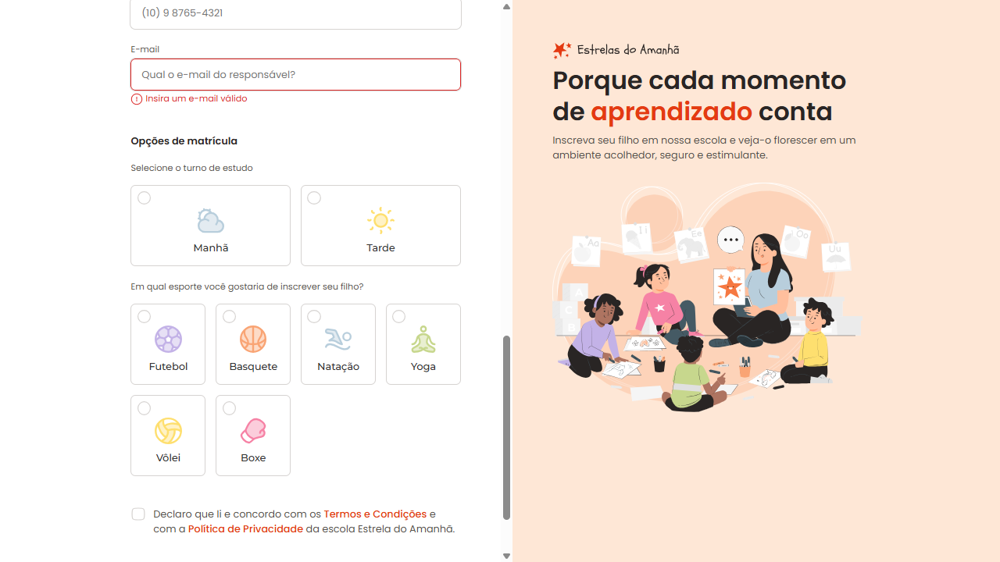
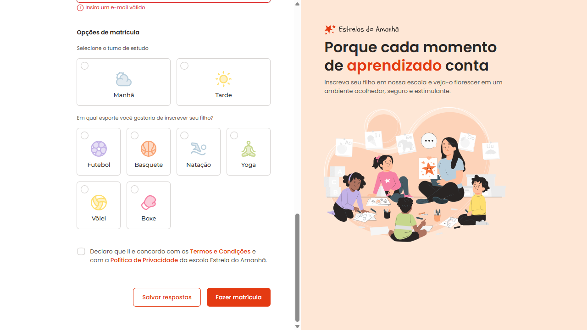

# Formulário de Matrícula

Este é um projeto de um formulário de matrícula, desenvolvido com **HTML** e **CSS**. O formulário permite selecionar turno de estudo, modalidade esportiva, preencher dados pessoais e aceitar termos, utilizando componentes customizados como radios, checkboxes, inputs e área de upload. O layout foi projetado com foco em organização, acessibilidade e boa experiência do usuário.

## Tecnologias Utilizadas

* **HTML5**: Estruturação semântica do formulário e dos campos.
* **CSS3**: Estilização modular com arquivos separados por responsabilidade, utilizando Grid, Flexbox e CSS Nesting.
* **Google Fonts**: Fontes "Poppins" e "Montserrat" para tipografia do projeto.

## Estrutura do Projeto

O projeto está organizado da seguinte forma:

* `index.html`: Estrutura principal do formulário de matrícula.
* `styles/index.css`: Arquivo principal que centraliza a importação dos estilos.
* `styles/global.css`: Reset de estilos, variáveis CSS e estilos globais.
* `styles/layout.css`: Definição do layout da página (main e aside).
* `styles/form.css`: Estilização geral do formulário, fieldsets e ações.
* `styles/fields/`: Pasta responsável pelos componentes do formulário:
  * `input.css`: Inputs, selects, textareas e validações.
  * `droparea.css`: Área de upload de arquivos.
  * `radio.css`: Radios customizados para seleção de opções.
  * `checkbox.css`: Checkbox customizado para termos de uso.
  * `button.css`: Botões primário e secundário.
* `assets/`: Pasta com ícones, imagens, capturas de tela da página e recursos visuais utilizados no formulário.

## Como Visualizar o Projeto

Acesse diretamente pelo link: [Formulário de Matrícula no GitHub Pages](https://dandiels.github.io/projeto-formulario-de-matricula/).

Ou, se preferir:

1. Clone este repositório:

   ```bash
   git clone https://github.com/Dandiels/projeto-formulario-de-matricula.git
   ```
2. Abra o arquivo `index.html` em um navegador web.

## Funcionalidades

* Seleção de turno de estudo (manhã ou tarde).
* Escolha da modalidade esportiva por meio de cards interativos.
* Preenchimento de dados pessoais do aluno.
* Upload de documentos por área de arrastar e soltar.
* Aceite de termos e condições.
* Validação visual de campos obrigatórios.
* Interface responsiva e acessível.

## Capturas de Tela









## Créditos

Projeto desenvolvido como exercício prático de **HTML e CSS**, com inspiração nos conteúdos educacionais da **Rocketseat**.